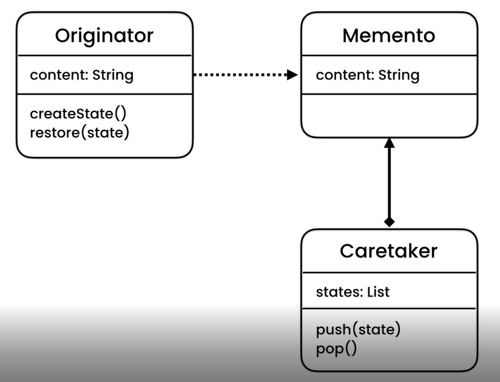
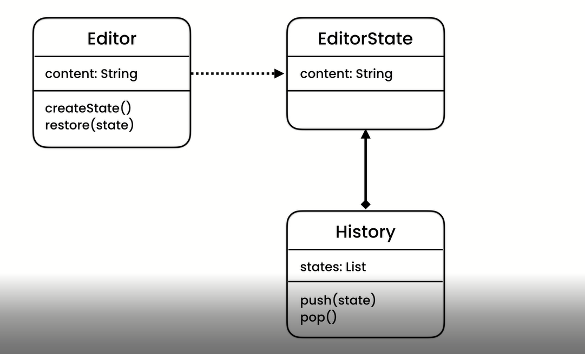

# Momento Pattern

###Memento pattern UML representation

### Problem:
- Captures and restore object internal state
- In these example the problem is implementing the undo feature of a code editor

### Solution
- Create a new class EditorState (momento)
- Create another class called History for implementing adding(push) and removing(pop) editor state (caretaker)
- Add method createState that create and return editor state object in the editor class editor
- Add method restore that takes the state object and restore object state, note that it depends on state
- Add editor state object in the editor, ie use composition
- For implementation details see th codes

##UML representation

### Application
- Application: Implementing undo mechanism

#[Exercise](./exercise/exe.md)