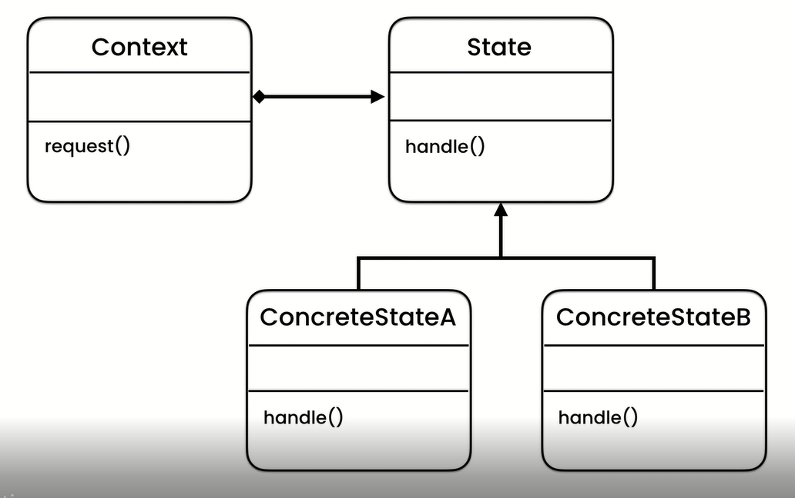

#State pattern

##State pattern UML representation

### Problem:
- Notifying change to other objects or another object
- In these example the problem is implementing canvas where the mouse icon respond
with respect to tool selected

### Solution
- Create a new class Canvas (Context) with attribute current tool plus its accessor methods, mouse 
up and down methods where the current tool mouse up and down methods will be called
- Create another Abstract class or interface called Tool (State) with contractual methods mouse down and up 
to be implemented by other concrete tool classes
- Create now the concrete tool classes that implements the tool interface, you can create as many 
tools as you like hence so extensible and implement code specifics for mouse up and down. See the main class for use

###Solution UML Representation

### Application
- Application: Implementing undo mechanism

#[Exercise](./exercise/exe.md)